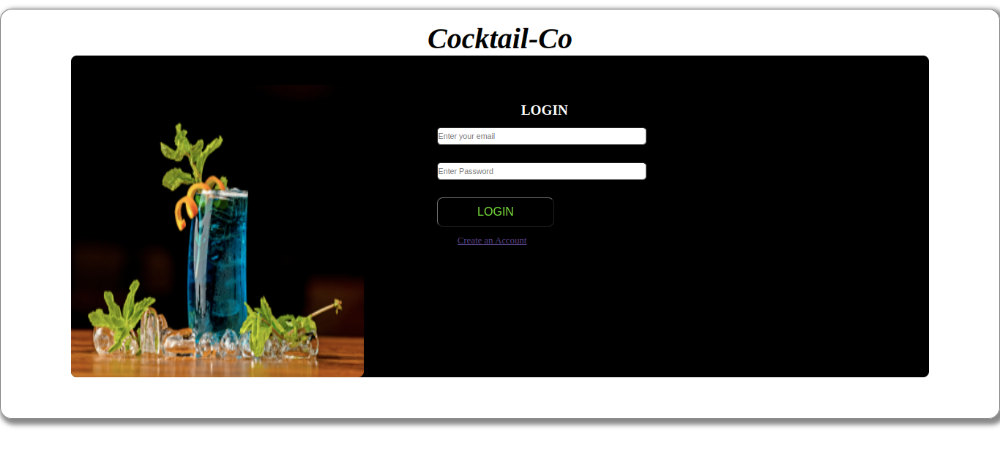
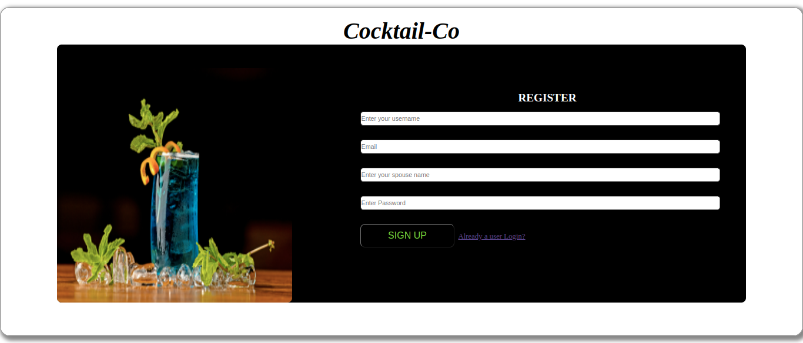
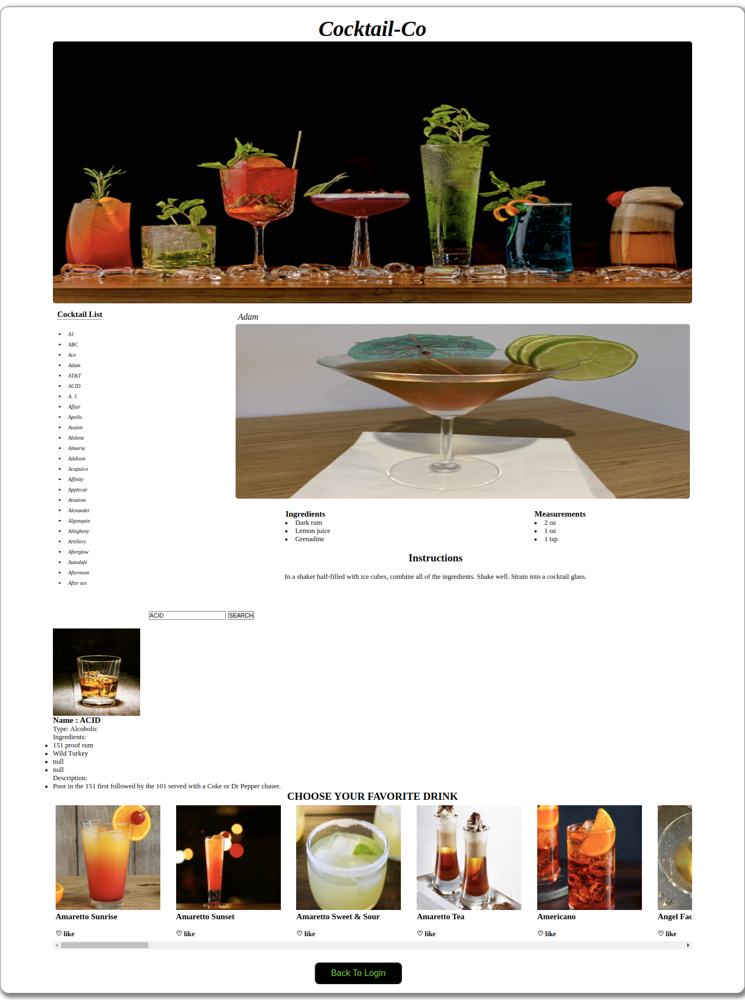

# COCTAIL_CO

This is a website that users can get informations about cocktails like recipes, ingredients and its measurements.

---
# Author : 
Daisy Chepyegon

---

## Screenshot

### LOGIN PAGE

### REGISTER PAGE

### MAIN PAGE

# Table of Content
*[Technologies]

*[description]

*[features]

*[project-setup]

*[project-usage]

*[licence]

# Technologies

languages used are:

*HTML: used to create the structure of the page

*css: used to style the page

*javascript: used to program the behavior of the web page

# Features

* A user is able to:

register and login into the page

view the contents of the page

use the navigation the cocktail list to navigate through the contents

# Description

This web application is user to help its users get information about cocktails at the comfort of their homes.They can get the ingredients as well as the instructions on how to make them.

# Challanges

the major challange i faced was implementing the search and the like button
---
# Project Setup Instuctions

* 1)Installation of the Visual studio code. 2)Git cloning the repository. 3)Make sure the live server extension is installed . 4)Click on Go live . 5)Initializing of git ,git add files,git commit and git push on a different branch.  6)Publisihing of the project on Github using Github-pages.

## clone repo

* clone the repo using the command: git clone 
https://github.com/DaisyChepyegon/Cocktail-Co

* unzip the folder 

* run the index.html on your browser

# Contributing to the project

*Fork the repo

*Create a new branch in your terminal (git checkout -b improve-feature)

*Install the prerequisites

*Make appropriate changes in file(s)

*Run the server to see the changes

*Add the changes and commit them (git commit -am "Improve App")

*Push to the branch (git push origin improve-app)

*Create a Pull request

## live link

* click the following link to view the application

 https://daisychepyegon.github.io/Cocktail-Co/

---

## Contact Information
* Email: daisychpyegon@gmail.com

# Licence

Copyright (c) [2022] [Cocktail-Co] Permission is hereby granted, free of charge, to any person obtaining a copy of this software and associated documentation files (the "Software"), to deal in the Software without restriction, including without limitation the rights to use, copy, modify, merge, publish, distribute, sublicense, and/or sell copies of the Software, and to permit persons to whom the Software is furnished to do so, subject to the following conditions:

The above copyright notice and this permission notice shall be included in all copies or substantial portions of the Software.

THE SOFTWARE IS PROVIDED "AS IS", WITHOUT WARRANTY OF ANY KIND, EXPRESS OR IMPLIED, INCLUDING BUT NOT LIMITED TO THE WARRANTIES OF MERCHANTABILITY, FITNESS FOR A PARTICULAR PURPOSE AND NONINFRINGEMENT. IN NO EVENT SHALL THE AUTHORS OR COPYRIGHT HOLDERS BE LIABLE FOR ANY CLAIM, DAMAGES OR OTHER LIABILITY, WHETHER IN AN ACTION OF CONTRACT, TORT OR OTHERWISE, ARISING FROM, OUT OF OR IN CONNECTION WITH THE SOFTWARE OR THE USE OR OTHER DEALINGS IN THE SOFTWARE.

